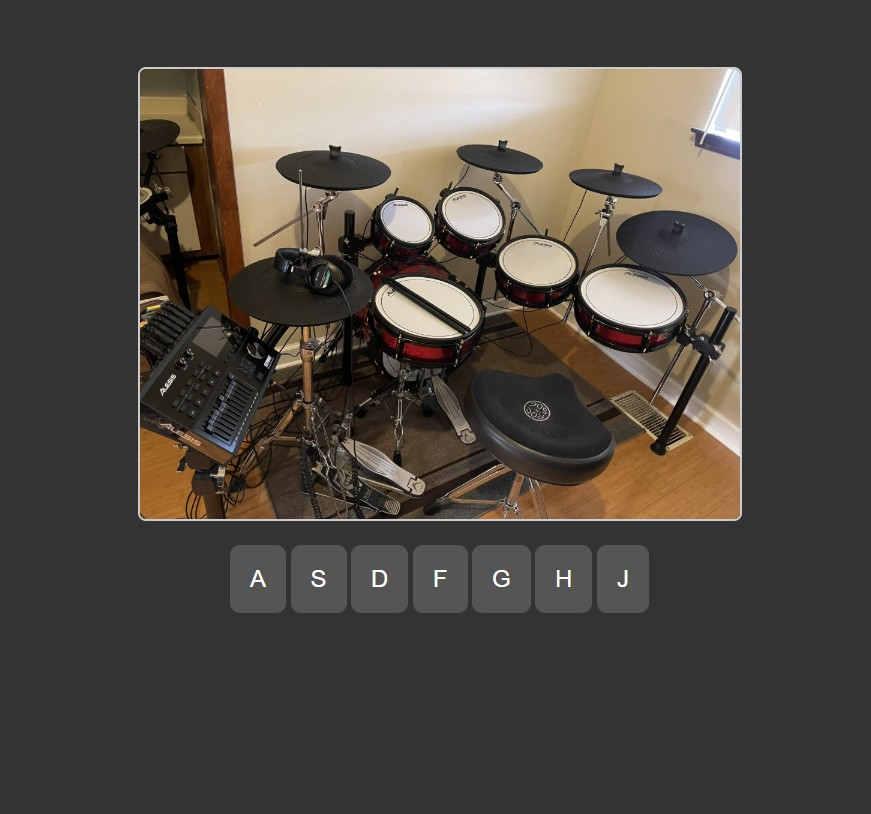

# Drum Kit Project

This is a simple Drum Kit project built using HTML, CSS, and JavaScript. Click the link below to view it live!

[🌐 Live Demo](https://yyigitgokmen.github.io/W5Drumkit/)

---

### How It Works
- Click or press keyboard keys to play drum sounds.
- The buttons light up when pressed for a cool animation effect.

### Features
- Responsive design.
- Interactive sound and animation.
